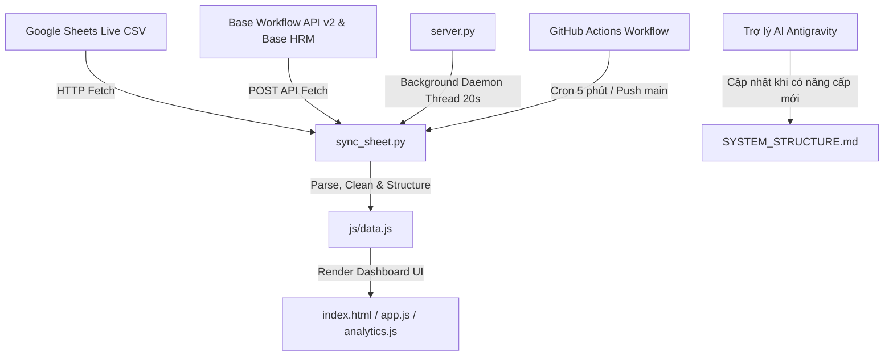

# 🏛️ TÀI LIỆU CẤU TRÚC VÀ CHỨC NĂNG HỆ THỐNG
> **Bảng Theo Dõi Tiến Độ Pháp Lý Chi Tiết Hồ Sơ (Dự Án Khu Đô Thị Mới Bình Quới - Thanh Đa)**
> 
> 📌 *Tài liệu này tổng hợp toàn bộ kiến trúc, cấu trúc thư mục, chức năng hệ thống và quy trình đồng bộ dữ liệu.*
> 🤖 *Khi có bất kỳ thay đổi, nâng cấp hoặc phát sinh hệ thống mới, Trợ lý AI (Antigravity) sẽ trực tiếp cập nhật file Markdown này.*

---

## 📊 1. Thống Kê Tổng Quan Hệ Thống

| Chỉ số | Giá trị |
| :--- | :--- |
| 📁 **Dự án / Phân khu:** | Dự án Khu đô thị mới Bình Quới - Thanh Đa (KP 17, KP 18, KP 19) |
| 📄 **Khối lượng hồ sơ quản lý:** | **1.141+ Hồ sơ** bồi thường & xác nhận nguồn gốc đất |
| ⚡ **Chế độ vận hành:** | Chạy Offline 100% / Auto Sync Google Sheet & Base API Live |
| 🔄 **Tần suất tự động đồng bộ:** | Local Background Daemon Thread: **20 giây** <br> GitHub Actions CI/CD: **5 phút** |
| 🌐 **Công nghệ áp dụng:** | HTML5, CSS3 (Custom Variables, Light/Dark Mode), JavaScript (Vanilla ES6+), Chart.js, Python HTTP Server, Base API v2, Base HRM API |

---

## 📁 2. Cấu Trúc Thư Mục & Danh Sách Tệp Tin Mã Nguồn

```
Bang tien do cap nhat ho so/
├── index.html                           # Giao diện Dashboard chính (HTML5)
├── README.md                            # Hướng dẫn sử dụng nhanh 1-Click
├── SYSTEM_STRUCTURE.md                  # Tài liệu cấu trúc & chức năng hệ thống
├── RUN_START.bat                        # Script 1-Click khởi chạy ứng dụng Windows
├── server.py                            # Python HTTP Web Server (Port 8888) & Auto-sync Daemon 20s
├── sync_sheet.py                        # Backend Python sync dữ liệu Google Sheet, Base Workflow & HRM
├── .gitignore                           # Cấu hình Git Ignore
├── .github/
│   └── workflows/
│       └── sync_base_data.yml           # GitHub Actions Workflow tự động đồng bộ mỗi 5 phút
├── css/
│   └── style.css                        # Hệ thống Styling, Grid, Light/Dark Theme, Micro-animations
├── js/
│   ├── app.js                           # Logic chính Frontend (Render tables, Filters, Modal, Export)
│   ├── analytics.js                     # Logic Thống kê & Biểu đồ Chart.js
│   ├── data.js                          # Cache Dữ liệu Live JSON của 1.141+ hồ sơ
│   └── chart.min.js                     # Thư viện Chart.js Offline
└── scratch/                             # Thư mục chứa script kiểm tra/báo cáo dữ liệu trùng lặp
```

### Chi Tiết Vai Trò Từng Tệp Tin:

| Đường dẫn Tệp tin | Mô tả Vai trò & Chức năng |
| :--- | :--- |
| `index.html` | Trang Dashboard chính với cấu trúc chuẩn HTML5 semantic: Header (Realtime Clock, Sync status, Action buttons), KPI Cards, Biểu đồ Chart.js, Bảng I - V, Filter Toolbar, Modal detail. |
| `css/style.css` | Hệ thống CSS thuần linh hoạt. Quản lý tokens màu HSL, chế độ Dark/Light Mode, layout Responsive Grid, kiểu dáng bảng biểu chuyên nghiệp, badge trạng thái và hiệu ứng hovers. |
| `js/app.js` | Module điều khiển UI chính. Phụ trách render dữ liệu Bảng I, II, III, IV, V; xử lý bộ lọc tìm kiếm đa điều kiện; sự kiện click xem Modal chi tiết; xuất file Excel CSV UTF-8 BOM và In PDF. |
| `js/analytics.js` | Module xử lý thống kê & hiển thị biểu đồ Chart.js: Biểu đồ đường Timeline diễn biến hồ sơ theo ngày và Biểu đồ vành khăn (Doughnut) phân bổ theo Phân khu. |
| `js/data.js` | Tệp chứa toàn bộ dữ liệu JSON được sinh tự động từ script backend (`DOSSIER_DATA`, `TABLE_VII_DATA_DAILY`, `TABLE_VII_DATA_WEEKLY`, `BASE_WORKFLOW_COUNTS`, `BASE_JOBS_MAP`, `BASE_HRM_NAMES`). |
| `js/chart.min.js` | Thư viện Chart.js bản rút gọn phục vụ vẽ biểu đồ offline không cần kết nối Internet. |
| `sync_sheet.py` | Script Python Backend: Kết nối cào dữ liệu Google Sheet CSV, REST API Base Workflow Jobs v2 & Base HRM API (Lấy danh xưng phòng ban/cán bộ chuẩn hóa), tính toán thống kê và cập nhật `js/data.js`. |
| `server.py` | Web Server Python nhẹ chạy trên cổng `8888`. Khởi chạy luồng Daemon `auto_sync_daemon` chạy ngầm mỗi 20 giây để tự động thực thi `sync_sheet.fetch_and_sync()`. |
| `RUN_START.bat` | File khởi chạy 1-Click dành cho người dùng Windows: Tự động chạy Python đồng bộ dữ liệu, bật Web Server local và mở ngay trang web trên trình duyệt mặc định. |
| `.github/workflows/sync_base_data.yml` | Cấu hình CI/CD trên GitHub Actions tự động thực thi `sync_sheet.py` mỗi 5 phút và tự động commit/push dữ liệu `js/data.js` mới nhất lên branch `main`. |
| `README.md` | Tài liệu hướng dẫn sử dụng nhanh, liên kết khởi chạy dự án. |
| `SYSTEM_STRUCTURE.md` | File tài liệu cấu trúc hệ thống (File này), lưu trữ và bảo trì bởi Trợ lý AI. |

---

## 🌟 3. Chi Tiết Các Chức Năng Hệ Thống

### 3.1. Header & Thanh Điều Hành
- **Đồng hồ thời gian thực (`liveClockDisplay`):** Cập nhật theo từng giây.
- **Badge trạng thái đồng bộ (`sheetSyncBadge`):** Hiển thị tín hiệu đồng bộ live.
- **Nút Nguồn Auto Sync (`syncSheetBtn`):** Cho phép kích hoạt đồng bộ thủ công ngay lập tức.
- **Chế độ Giao diện Dark / Light Mode (`themeToggleBtn`):** Chuyển đổi giao diện sáng/tối linh hoạt, lưu trạng thái người dùng vào `localStorage`.
- **Xuất Báo Cáo Excel CSV (`exportCsvBtn`):** Xuất dữ liệu bảng hiện tại ra tệp CSV hỗ trợ Unicode UTF-8 BOM hiển thị chuẩn tiếng Việt trên Excel.
- **In Báo Cáo / Xuất PDF (`printReportBtn`):** Tự động chuẩn hóa giao diện trang in khổ ngang A4/A3.

### 3.2. Thẻ KPI Summary Cards (Tổng Quan Số Liệu)
1. **Tổng Hồ Sơ Chuyển:** Thống kê tổng số 1.141+ hồ sơ đã nhận từ Ban Bồi Thường.
2. **Đã Thông Qua Pháp Lý:** Số lượng hồ sơ & % tỷ lệ hoàn thành (thủ tục nhận định pháp lý thành công).
3. **KTHT Đang Giữ Thụ Lý:** Số lượng hồ sơ & % tỷ lệ Phòng Kinh Tế - Hạ Tầng - Đầu Tư đang xử lý.
4. **Trả Sửa / Chuyển Lại:** Số lượng hồ sơ & % tỷ lệ hồ sơ cần chỉnh sửa/bổ sung bản vẽ, pháp lý.

### 3.3. Hệ Thống Biểu Đồ Trực Quan (Chart.js)
- **Biểu đồ Timeline (Line Chart):** Theo dõi số lượng hồ sơ chuyển giao theo từng mốc thời gian ngày.
- **Biểu đồ Phân khu (Doughnut Chart):** Trực quan hóa tỷ lệ hồ sơ thuộc Phân Khu 17, Khu Phố 18 và Khu Phố 19.

### 3.4. Các Bảng Thống Kê Chuyên Sâu (Tables I đến V)
- **Bảng I:** Tiến độ pháp lý & phân biệt điều hành theo Tổ Bồi Thường (Tổ 1 - KP17, Tổ 2 - KP18, Tổ 3 - KP19).
- **Bảng II:** Chi tiết diễn biến các trạng thái hồ sơ theo từng phân khu.
- **Bảng III:** Thống kê tỷ lệ diện tích giải tỏa (Toàn phần / Một phần).
- **Bảng IV (Master Table Ban Bồi Thường):** Thống kê chi tiết khối lượng hồ sơ chuyển về theo mốc thời gian (**Ngày**, **Tuần**, **Tháng**) và từng Cán bộ Ban Bồi Thường (CBTL). Cấu trúc cột tối ưu gồm: `STT`, `Thời gian chuyển`, `CBTL`, `Tổ bồi thường (Phân khu)` (gộp 1 cột), cùng các cột `Tổng HS Nắm giữ Base`, `Tổng HS đã chuyển`, `Tổng HS đã thông qua`, `Tổng HS KTHT giữ`, `HS Trả sửa` xếp lên phía trước.
- **Bảng V / Bảng VII (Master Table KTHT & Pháp Chế):** Thống kê chi tiết khối lượng hồ sơ xử lý theo mốc thời gian (**Ngày**, **Tuần**, **Tháng**) và từng Cán bộ Thụ lý KTHT / Cán bộ Pháp chế kiểm tra. Cấu trúc cột tối ưu gồm: `STT`, `Thời gian chuyển`, `Cán bộ thụ lý / Pháp chế`, `Phân khu` (gộp 1 cột), cùng các cột `Tổng HS xử lý`, `Số HS duyệt`, `HS Trả sửa`, `Ghi chú`.

### 3.5. Bộ Lọc Thông Minh & Tra Cứu (Smart Filter Toolbar)

Hệ thống dùng **3 thanh lọc đồng bộ 2 chiều**: thanh Tổng (đầu trang), thanh riêng của **Bảng IV** và **Bảng V**. Thay đổi ở bất kỳ thanh nào đều được `syncFilterControls()` phản chiếu sang 2 thanh còn lại và **lọc chung toàn bộ dashboard**. Mọi hàm render đọc tiêu chí từ một state dùng chung `currentFilter` (không đọc DOM rời rạc).

- **Tìm kiếm thông minh (bỏ dấu + đa từ khóa):** Khớp không phân biệt dấu tiếng Việt qua `Analytics.removeVietnameseTones`, tách nhiều từ khóa theo kiểu AND. Bảng IV tra trên toàn bộ trường hồ sơ (mã HS, chủ hộ, địa chỉ, số tờ, số thửa, cán bộ…). Bảng V lấy nguồn Google Sheet riêng (Bảng VII) nên tra theo **Cán bộ pháp chế / Thời gian / Phân khu / Ghi chú** — có thông báo rõ khi từ khóa không thuộc các trường này.
- **Debounce 220ms:** Thao tác gõ chỉ chạy lọc + vẽ lại sau khi ngừng gõ, tránh giật khi lọc hơn 1.500 hồ sơ và vẽ lại biểu đồ theo từng ký tự.
- **Lọc Phân khu:** Tất cả / KP 17 / KP 18 / KP 19 (kèm chip lọc nhanh).
- **Lọc Khoảng ngày (Từ – Đến):** Hai ô calendar `type=date`, khớp theo Ngày chuyển HOẶC Ngày trả về; riêng Bảng V so **giao khoảng (overlap)** để xử lý đúng cả mốc ngày lẫn mốc tuần dạng `"1/7/2026 - 5/7/2026"`.
- **Lọc Trạng thái (khớp mã chính xác):** Đã thông qua (`3.`), KTHT đang giữ (`1.`), Trả sửa lần 1 (`2.1`), Chuyển sửa lại (`4.`) — so theo mã ở đầu chuỗi nên chọn `"1."` không dính nhầm `"2.1."`.
- **Banner "đang lọc" + Badge kết quả:** Cả 3 thanh hiển thị số hồ sơ khớp và tóm tắt tiêu chí; nút xóa (×) hiện/ẩn theo nội dung từng ô.
- **Nút Đặt lại (Reset Filter):** Xóa toàn bộ bộ lọc, đưa 3 thanh về mặc định.

### 3.6. Cửa Sổ Xem Chi Tiết Hồ Sơ (Modal Popup)
- Nhấp chuột vào bất kỳ dòng hồ sơ nào trên bảng dữ liệu để hiển thị popup thông tin pháp lý chi tiết toàn bộ các trường dữ liệu của hồ sơ đó.

---

## ⚙️ 4. Luồng Xử Lý Backend & Đồng Bộ Dữ Liệu Live



1. **Script Đồng bộ Dữ liệu (`sync_sheet.py`):**
   - Kết nối lấy dữ liệu từ Google Sheets công khai.
   - Gọi Base Workflow API v2 (`workflow/jobs`) để lấy tiến độ thực tế trên phần mềm quản lý công việc Base.
   - Gọi Base HRM API (`employee/list` & `area/list`) để làm sạch tên cán bộ và tổ/phòng ban.
   - Kết xuất dữ liệu sang `js/data.js`.

2. **Web Server & Background Daemon (`server.py`):**
   - Phục vụ Web Server cổng `8888`.
   - Khởi chạy một luồng daemon độc lập (`auto_sync_daemon`) chạy định kỳ mỗi **20 giây** tự động đồng bộ dữ liệu live mà không làm gián đoạn người dùng.

3. **Tự động hóa CI/CD (`.github/workflows/sync_base_data.yml`):**
   - GitHub Actions runner chạy ngầm mỗi **5 phút**, tự động cào dữ liệu mới nhất và commit vào repository.

---

## 🆕 5. Nhật Ký Thay Đổi Gần Đây (Changelog)

### 06/08/2026 — Viết lại logic & UI tìm kiếm/lọc Bảng IV–V
- **Sửa lỗi nghiêm trọng:** `renderSection7` (Bảng V) tham chiếu biến chết `ngayChuyenSelect7` — tàn dư của thiết kế dropdown ngày cũ đã bị thay bằng ô calendar — gây `ReferenceError` ở bước render **cuối cùng**, làm văng và **hủy phần khởi tạo còn lại**: Bảng V trống hoàn toàn, `updateChipCounts()` không chạy (chip mất số đếm), và **auto-sync không khởi động**. Đã xóa lỗi và gỡ hàm chết `populateDateDropdown()`.
- **State lọc dùng chung `currentFilter`:** Gom tiêu chí lọc về một nơi; `renderSection6/7` đọc từ đây thay vì tự đọc DOM rời rạc (tránh lệch nguồn).
- **Tìm kiếm bỏ dấu + đa từ khóa (AND)** cho cả Bảng IV và Bảng V (Bảng V trên nguồn Google Sheet — Cán bộ/Thời gian/Phân khu/Ghi chú).
- **Lọc khoảng ngày Bảng V theo giao-khoảng:** Xử lý đúng `timeKey` dạng ngày (`"01/07/2026"`) lẫn tuần (`"1/7/2026 - 5/7/2026"`); sửa nhãn cột tuần/tháng không còn hiển thị `"Khác"`.
- **Lọc trạng thái khớp mã chính xác** (`statusCode`) — hết cảnh chọn `"1."` dính nhầm `"2.1."` (lỗi tiềm ẩn, sẽ lệch khi có hồ sơ trả-sửa-lần-1 đổ về qua live-sync).
- **Debounce 220ms** khi gõ; **banner "đang lọc"** cho Bảng V; đồng bộ badge/banner/nút xóa cả 3 thanh; empty-state Bảng V rõ nghĩa.
- **CSS bộ lọc/tìm kiếm** (`.filter-toolbar`, `.search-box`, `.filter-banner`…) bổ sung/hoàn thiện trong `css/style.css`.
- Commit liên quan: `b4c2721` (logic/UI), `09be549` (CSS).

> ⚠️ **Quy ước cache-bust bắt buộc:** Sau khi sửa `js/*.js`, phải tăng chuỗi `?v=YYYYMMDD_n` ở các thẻ `<script>` trong `index.html` (cả `data.js`, `analytics.js`, `app.js`), nếu không trình duyệt sẽ dùng bản cache cũ và thay đổi không hiển thị.

---

## 📝 6. Quy Trình Cập Nhật Tài Liệu Này

- Khi có **tính năng mới, module mới, hoặc thay đổi về cấu trúc hệ thống**, Trợ lý AI (Antigravity) sẽ chủ động cập nhật trực tiếp tệp [SYSTEM_STRUCTURE.md](file:///d:/code%20banqlda/Bang%20tien%20do%20cap%20nhat%20ho%20so/SYSTEM_STRUCTURE.md) này để đảm bảo tài liệu luôn đồng bộ 100% với mã nguồn hiện tại của dự án.

---
*Bản quyền &copy; 2026 Ban Bồi Thường & Phòng Kinh Tế - Hạ Tầng - Đầu Tư*
